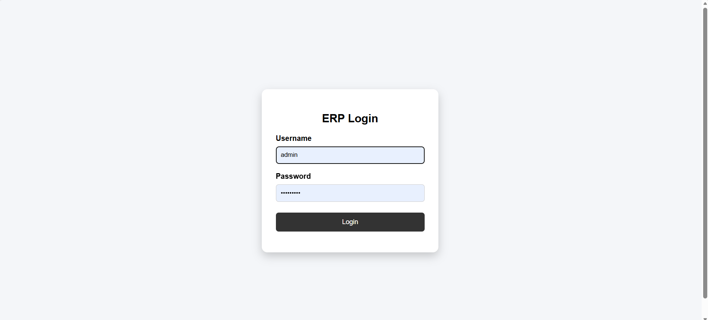
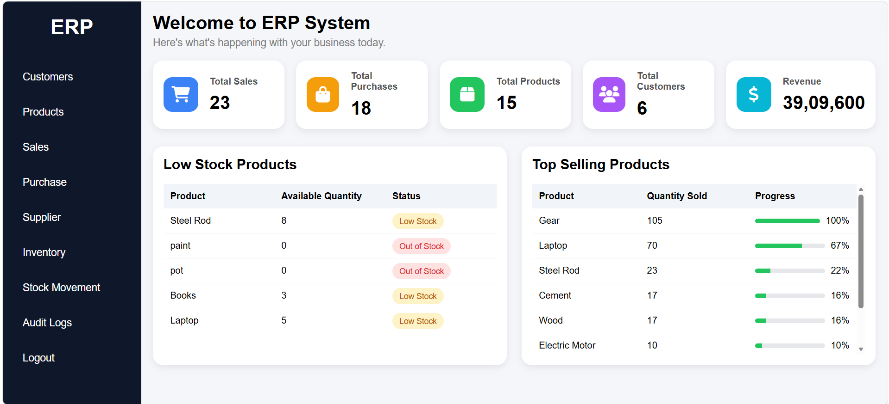
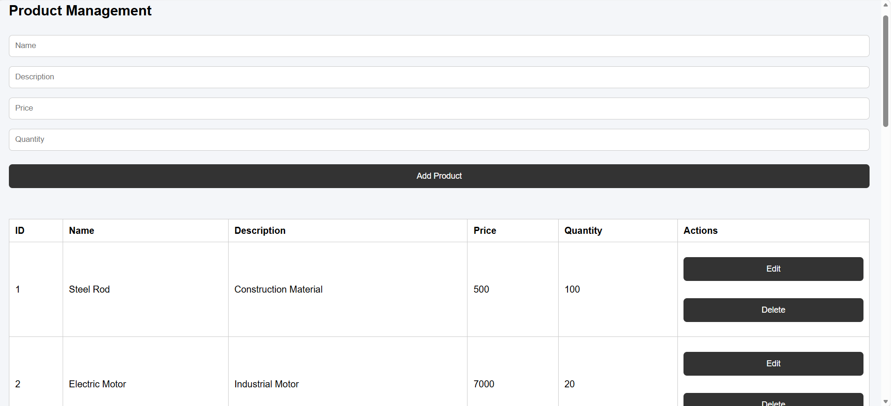
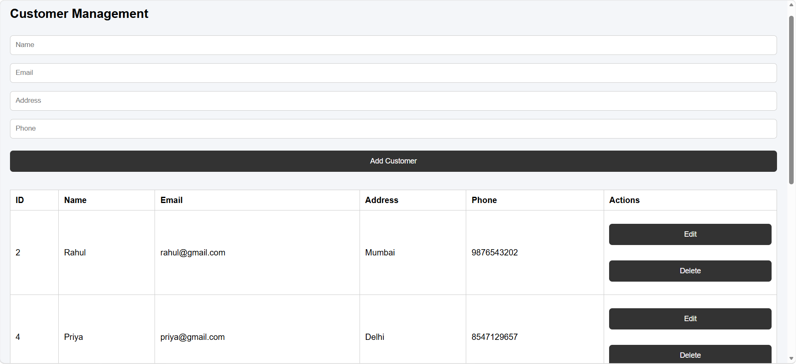
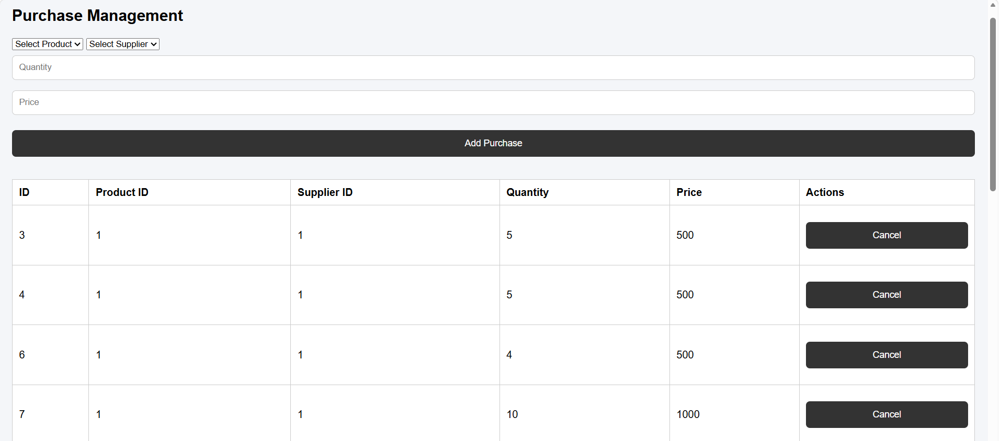
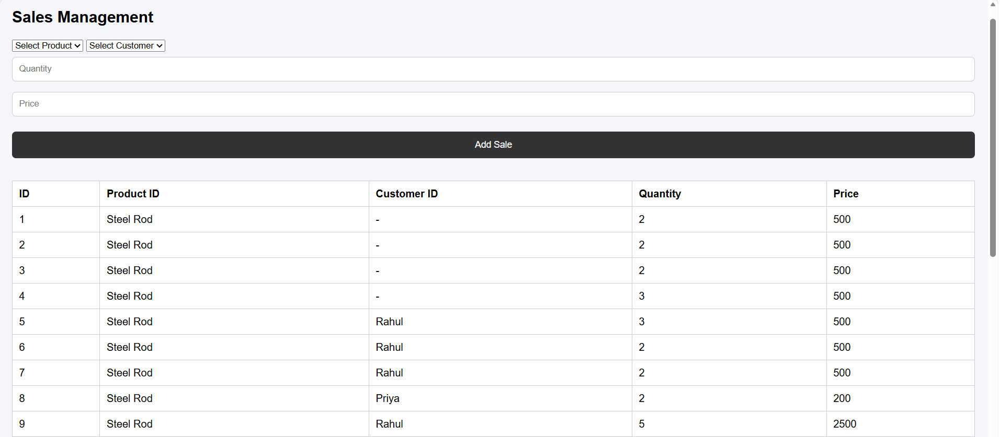
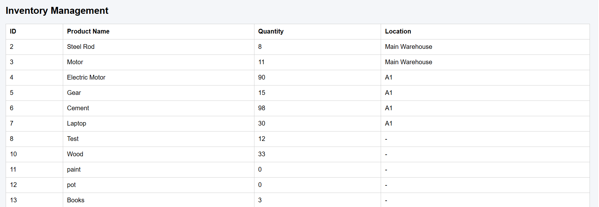
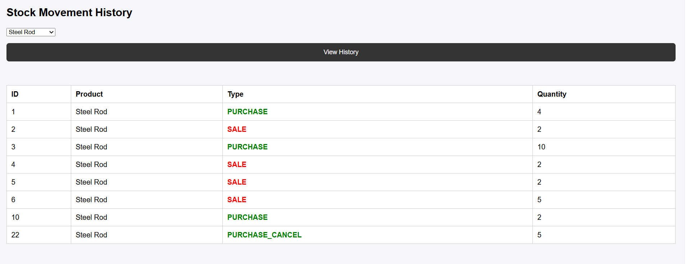
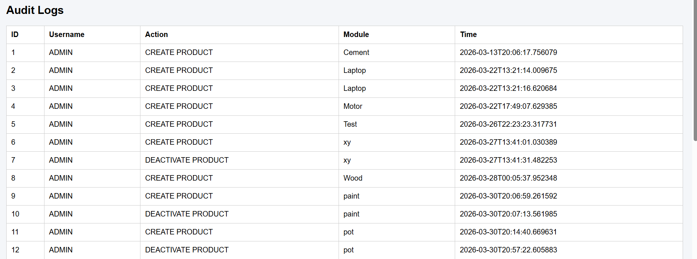

# Mini Manufacturing ERP System

## Project Overview

The Mini Manufacturing ERP System is a web-based Enterprise Resource Planning (ERP) application developed to help manufacturing businesses manage their daily operations efficiently. The system provides modules for product management, customers, suppliers, purchases, sales, inventory, stock movement, audit logs, and dashboard analytics.

---

## Technologies Used

### Frontend
- HTML
- CSS
- JavaScript

### Backend
- Java Spring Boot

### Database
- MySQL

### Tools
- Eclipse IDE
- Visual Studio Code
- MySQL Workbench
- GitHub

---

## Features

- User Login with JWT Authentication
- Role-Based Access Control (Admin, Manager, Staff)
- Product Management
- Customer Management
- Supplier Management
- Purchase Management
- Sales Management
- Inventory Management
- Stock Movement History
- Audit Logs
- Dashboard Analytics

---

## Dashboard

The dashboard displays:

- Total Products
- Total Customers
- Total Purchases
- Total Sales
- Total Revenue
- Low Stock Products
- Top Selling Products

---

## Security Features

- JWT Authentication
- Password Encryption using BCrypt
- Role-Based Authorization
- Input Validation
- Soft Delete

---

## Project Structure

```
Backend/
Frontend/
Database/
```

---

## Database

MySQL database contains the following tables:

- users
- products
- customers
- supplier
- purchase
- sale
- inventory
- stock_movement
- audit_logs

---
# Project Screenshots

## Login Page



---

## Dashboard



---

## Product Management



---

## Customer Management



---

## Supplier Management


---

## Purchase Management



---

## Sales Management



---

## Inventory Management



---

## Stock Movement



---

## Audit Logs



---

## Database


## How to Run

1. Import the Spring Boot project into Eclipse.
2. Configure MySQL database.
3. Run the Spring Boot application.
4. Open the frontend in Visual Studio Code using Live Server.
5. Login using a valid user account.

---

## Future Enhancements

- Employee Management
- Order Management
- Finance Module
- Reports
- Email Notifications
- Barcode Scanner
- Production Planning

---

## Author

**Kirti Bisht**

MCA Project

Mini Manufacturing ERP System
